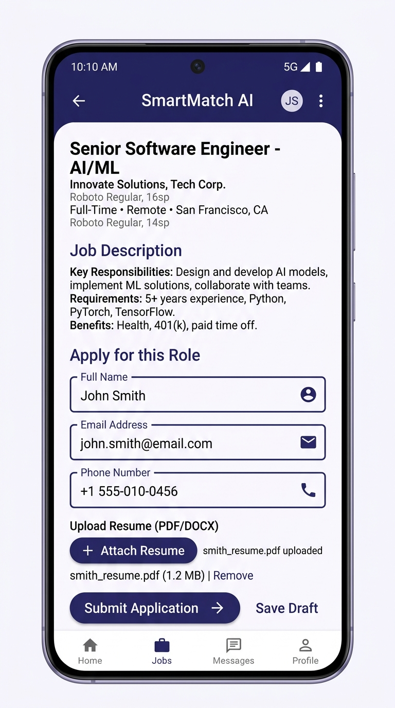
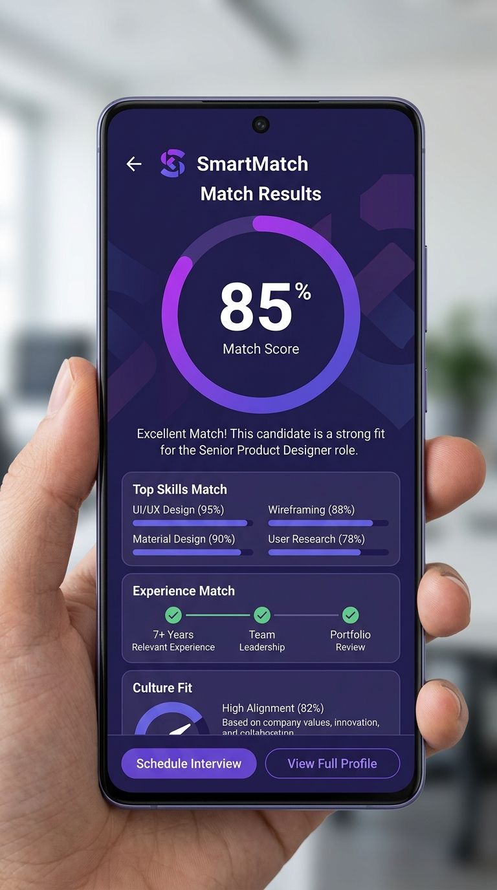
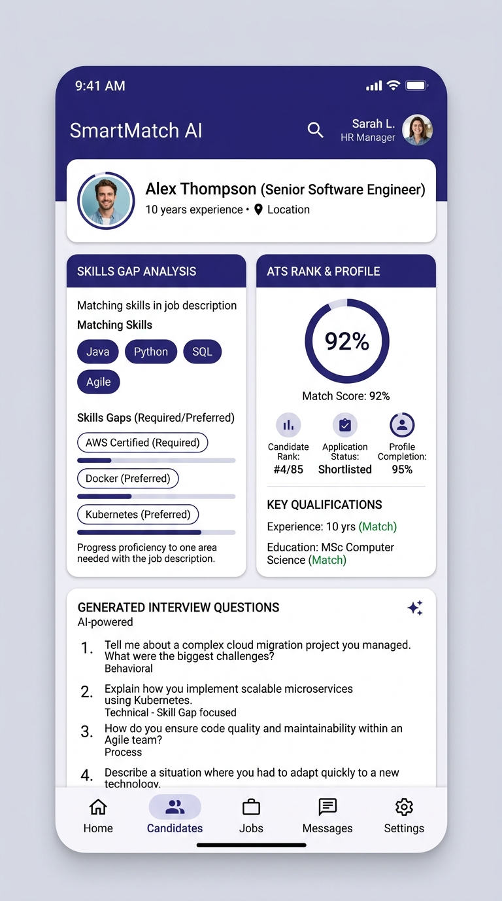
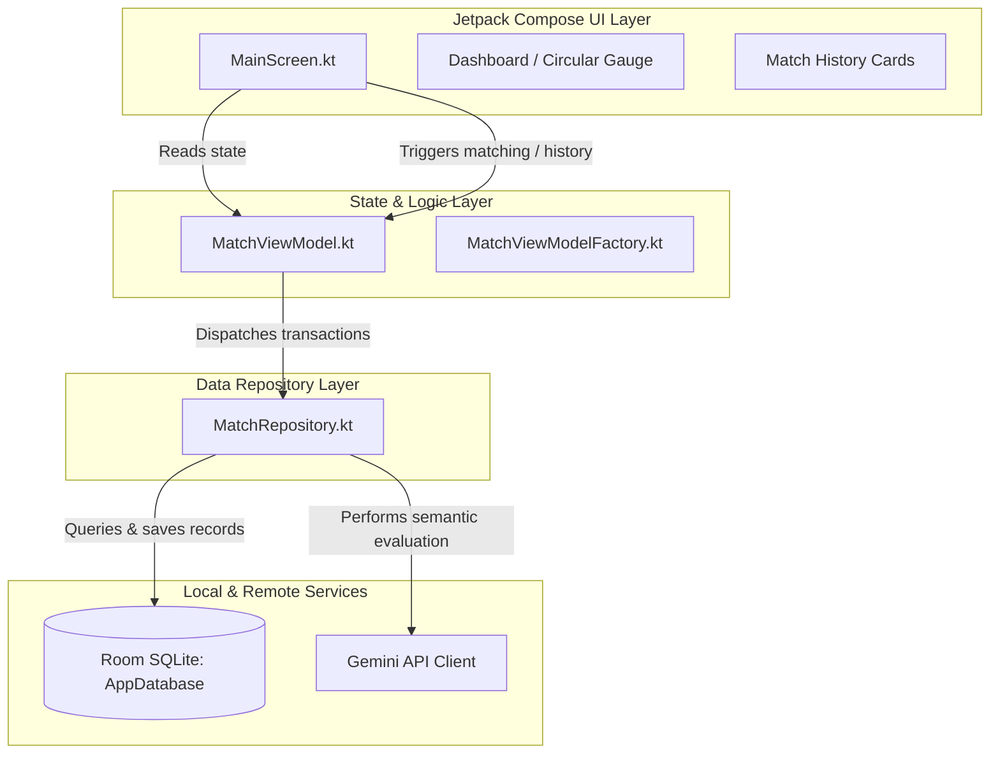
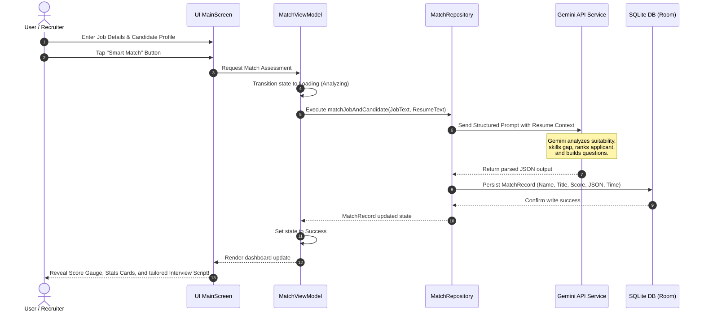

# 💼 SmartMatch AI Recruitment

[](https://developer.android.com)
[](https://kotlinlang.org)
[](https://developer.android.com/jetpack/compose)
[](https://ai.google.dev/)
[](LICENSE)

An advanced, modern Android recruitment screening assistant powered by **Google Gemini AI**. **SmartMatch AI Recruitment** assists recruiters and hiring managers in analyzing, evaluating, and matching candidate resumes with job descriptions. The application highlights suggested skill matches, identifies potential skill gaps, provides advisory ATS ranking estimates, and automatically compiles tailor-made interview questions—all stored securely in a local SQLite database using **Room** with an elegant, responsive, and tactile **Sleek Interface**.

---

## 📖 1. Project Overview & Status

* **Project Status**: 🛠️ **Active Prototype / Development**
* **Target Audience**: Recruiters, Technical Leads, and Hiring Managers seeking a local advisory screening helper.

Finding the right candidate among hundreds of applicants is one of the biggest bottlenecks in modern HR departments. **SmartMatch AI Recruitment** leverages state-of-the-art Generative AI models to assist in evaluating the semantic alignment between applicant resumes/profiles and specific job requirements.

Rather than relying purely on rigid keyword-matching tools, SmartMatch AI assists by scanning structural context, projects, and expressed skill depths. It translates complex textual profiles into simple visual dashboard indicators, offering supportive recruitment insights in seconds.

### 🛡️ AI Credibility & Trust Measures
* **No Simulated Numbers**: If the AI response cannot be parsed for a score percentage, the application strictly refuses to fabricate random "fallback scores." Instead, it gracefully renders the score as **N/A** (Not Available) alongside an explicit qualitative analysis notice to maintain professional trust.
* **Advisory Design**: The match metrics are presented as **supportive guidelines** to assist human review rather than fully automated hiring decisions.

---

## ✨ 2. Features

*   **📊 Dynamic Match Score Gauge**: A beautifully rendered, tactile custom circular progress gauge that reflects the estimated compatibility score of the candidate.
*   **🔍 Skill Gap Detection**: Instant, color-coded diagnostic summaries showing where the candidate excels and which prerequisites are missing.
*   **📑 Intelligent Candidate Profile Card**: Real-time generation of custom target role identifiers (`#SDE-XXX`) and live active states for screened candidates.
*   **💡 AI-Generated Interview Questions**: Custom-tailored behavioral and technical interview questions based directly on the identified skill gaps and experience.
*   **🗄️ Offline-First Recruiter Dashboard**: Secure local persistence utilizing **Android Room SQLite Database** to store past matches, compare scores, search records, and recall previous analyses instantly.
*   **📋 Quick-Test Templates**: Pre-loaded mock profiles (e.g., Senior DevOps, Frontend Developer, Mobile Engineer) to test matching performance in a single tap.
*   **🌐 Real-Time Google Gemini Integration**: Leverages the official Google AI client SDK to conduct secure client-side semantic analysis via Google's secure AI infrastructure.
*   **🎨 Sleek M3 Design Theme**: Fully optimized with edge-to-edge screens, fluid shadows, sleek high-contrast indigo gradients, and accessibility-compliant touch targets.

---

## 📸 3. Screenshots (Aesthetic Visual Layout)

The application utilizes a spacious **Sleek Layout** modeled around Material Design 3. Below are high-fidelity design mockups illustrating the visual architecture of the application screens:

| **1. Dynamic Job & Candidate Entry** | **2. AI Match Dashboard & Gauge** | **3. AI Insights & Custom Questions** |
| :---: | :---: | :---: |
|  |  |  |
| *Easy copy-paste template insertion and instant triggers.* | *Beautiful indigo Sleek circular progress and ATS stats cards.* | *Detailed positive matches, warnings, and tailored interview scripts.* |

---

## 🏗️ 4. Architecture

The application is structured around official Android Best Practices using **MVVM (Model-View-ViewModel)** and **Repository Pattern**, combined with an offline-first strategy.



---

## 🛠️ 5. Tech Stack

*   **Language**: [Kotlin](https://kotlinlang.org) — 100% modern, expressive language.
*   **UI Framework**: [Jetpack Compose](https://developer.android.com/jetpack/compose) — Declarative UI with Material 3 components.
*   **Theme**: Material Design 3 (M3) incorporating custom palettes, edge-to-edge drawing (`enableEdgeToEdge()`), and dynamic ripple touch actions.
*   **Database (Local)**: [Room Database](https://developer.android.com/training/data-storage/room) — Local SQLite ORM with Kotlin Symbol Processing (KSP).
*   **Concurrency**: [Kotlin Coroutines & Flow](https://kotlinlang.org/docs/coroutines-overview.html) — High-performance reactive state management.
*   **Generative AI Engine**: [Google Gemini Client SDK](https://ai.google.dev/gemini-api/docs) — Facilitating prompt engineering, parameter setup, and JSON response parsing.
*   **Testing Core**: [Robolectric](https://robolectric.org) & [Roborazzi](https://github.com/takahirom/roborazzi) — JVM-based screenshot, UI layout, and viewmodel state verification.

---

## 📥 6. Installation & Setup

Ensure you have the latest stable version of **Android Studio (Koala/Ladybug or newer)** and **JDK 17** installed.

### 1️⃣ Clone the Repository
```bash
git clone https://github.com/niphan1000/smartmatch-ai-recruitment.git
cd smartmatch-ai-recruitment
```

### 2️⃣ Project Execution (via Android Studio)
1. Open Android Studio.
2. Select **File -> Open** and navigate to the cloned directory.
3. Allow Gradle to sync dependencies and index the project structure.

### 3️⃣ Build the APK
To assemble a local debug build, execute the following Gradle task in your terminal:
```bash
./gradlew assembleDebug
```
The compiled APK will be generated at:
`app/build/outputs/apk/debug/app-debug.apk`

---

## ⚙️ 7. Configuration & Security Measures

The application incorporates strict privacy and secret protection parameters to keep both developer keys and candidate profiles secure.

### 🔐 Adding Your Gemini API Key Securely
To prevent keys from being leaked onto public version control systems (e.g., GitHub), we use the **Secrets Gradle Plugin** which loads parameters from an ignore-listed `.env` file at compile time:

1. Generate an API Key in the [Google AI Studio Console](https://aistudio.google.com/).
2. In the project root directory, locate the `.env.example` file and rename it to `.env`:
   ```bash
   mv .env.example .env
   ```
3. Open `.env` and assign your API key:
   ```env
   GEMINI_API_KEY="your_actual_gemini_api_key_here"
   ```
4. During Gradle compilation, this value is securely bound into `BuildConfig.GEMINI_API_KEY`.

### 🛡️ PII Protection & Backup Defenses
Candidate profiles, resumes, and interview responses are highly sensitive, personally identifiable information (PII). 
* **Disabled Cloud Backups**: In `AndroidManifest.xml`, we configure `android:allowBackup="false"`. This prevents candidate data stored in the local SQLite database from being extracted, synchronised, or backed up automatically through cloud extraction rules.
* **On-Device Sandbox**: All evaluation records remain strictly confined inside the application sandbox, persisting locally inside the Android Room SQLite layer. No external telemetry or trackers are active.

### 🛡️ Production Security & AI Architecture Roadmap
For production environments, client-side direct API key hosting is highly discouraged. We recommend transitioning to one of the following secure architectures:

1. **AI Backend Proxy Server (Recommended)**
   * **Structure**: `Android App` ➡️ `Your Private Backend API` (e.g., Express/FastAPI) ➡️ `Gemini API`.
   * **Advantage**: The Gemini API Key is safely stored as an environment variable entirely on your secure backend. You can apply rate limiting, authorization checks, and audit trails before proxying the requests to Google.
2. **Firebase Vertex AI SDK & App Check**
   * **Structure**: `Android App` ➡️ `Vertex AI SDK for Firebase` (with Google Cloud Backend).
   * **Advantage**: Leverages **Firebase App Check** to verify that incoming API requests are originating from your authentic, unmodified Android application, mitigating abuse and bot requests without manual backend maintenance.
3. **App Obfuscation (R8/ProGuard)**
   * During compilation, configure `minifyEnabled true` and `shrinkResources true` inside your production `build.gradle.kts` configuration to apply code-obfuscation, making reverse-engineering decompilation substantially more complex.

---

## 📂 8. Project Structure

```
app/src/main/java/com/example
├── MainActivity.kt               # Application entry point, loads the Sleek theme
├── data
│   ├── api
│   │   └── GeminiClient.kt       # Configures Gemini model parameters and prompts
│   ├── local
│   │   ├── AppDatabase.kt        # Room DB initializer
│   │   ├── MatchRecord.kt        # Database entity for offline matching records
│   │   └── MatchRecordDao.kt     # SQLite queries for match reports
│   ├── model
│   │   └── MatchResponse.kt      # AI analysis schema model (JSON representation)
│   └── repository
│       └── MatchRepository.kt    # Syncs local database updates and remote AI requests
└── ui
    ├── theme
    │   ├── Color.kt              # Sleek Theme color variables (Indigo and Purples)
    │   ├── Theme.kt              # Application-wide M3 theme setup
    │   └── Type.kt               # Headings, labels, and paragraph sizes
    ├── util
    │   └── ClipboardHelper.kt    # High-productivity copy actions
    ├── view
    │   └── MainScreen.kt         # The responsive interface containing Gauges, Forms, and AI lists
    └── viewmodel
        └── MatchViewModel.kt     # Manages asynchronous state transitions and presets
```

---

## ⚙️ 9. AI Match Pipeline & Workflow



---

## ⚠️ 10. Current Limitations

*   **Input Method**: The prototype currently relies on copy-pasting text from Resumes/Profiles. Direct `.pdf`, `.docx`, or `.pages` file uploads are not fully implemented.
*   **API Quota**: Subject to standard Google AI Studio free-tier request rate limitations.
*   **ATS Sync**: The dashboard maintains a local database but does not connect to enterprise Applicant Tracking Systems (e.g., Workday, Greenhouse) directly.

---

## 🗺️ 11. Project Roadmap

*   [ ] **PDF Parsing Core**: Support direct dragging or choosing of PDF resumes, automatically parsing PDF layouts into plain text in the background.
*   [ ] **LinkedIn Scanner Integration**: Quick parsing directly via a profile link.
*   [ ] **Multi-Candidate Board**: Side-by-side comparative charts of up to 4 candidates at once.
*   [ ] **Team Shared Folders**: Shared database syncing using Firebase to collaborate across multiple hiring managers.
*   [ ] **Interview Scheduling Integration**: Instantly link specific interview questions to Google Calendar slots.

---

## 🧪 12. Local JVM Testing

You can run automated, non-instrumented JVM Unit and Screen Verification tests directly. No emulator is required:

```bash
# Run all local JVM unit tests
./gradlew :app:testDebugUnitTest

# Record visual screenshot baselines (Roborazzi)
./gradlew :app:recordRoborazziDebug

# Compare current UI against visual baselines
./gradlew :app:verifyRoborazziDebug
```

---

## 📄 13. License

```
MIT License

Copyright (c) 2026 SmartMatch AI Recruitment

Permission is hereby granted, free of charge, to any person obtaining a copy
of this software and associated documentation files (the "Software"), to deal
in the Software without restriction, including without limitation the rights
to use, copy, modify, merge, publish, distribute, sublicense, and/or sell
copies of the Software, and to permit persons to whom the Software is
furnished to do so, subject to the following conditions:

The above copyright notice and this permission notice shall be included in all
copies or substantial portions of the Software.

THE SOFTWARE IS PROVIDED "AS IS", WITHOUT WARRANTY OF ANY KIND, EXPRESS OR
IMPLIED, INCLUDING BUT NOT LIMITED TO THE WARRANTIES OF MERCHANTABILITY,
FITNESS FOR A PARTICULAR PURPOSE AND NONINFRINGEMENT. IN NO EVENT SHALL THE
AUTHORS OR COPYRIGHT HOLDERS BE LIABLE FOR ANY CLAIM, DAMAGES OR OTHER
LIABILITY, WHETHER IN AN ACTION OF CONTRACT, TORT OR OTHERWISE, ARISING FROM,
OUT OF OR IN CONNECTION WITH THE SOFTWARE OR THE USE OR OTHER DEALINGS IN THE
SOFTWARE.
```
